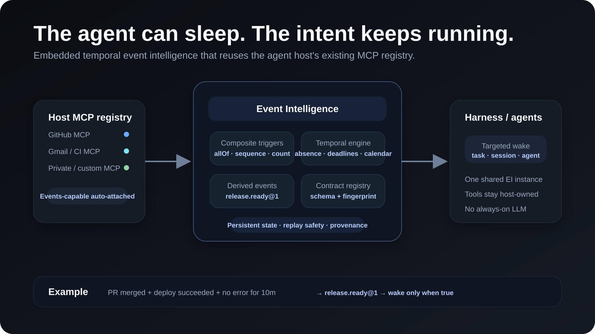
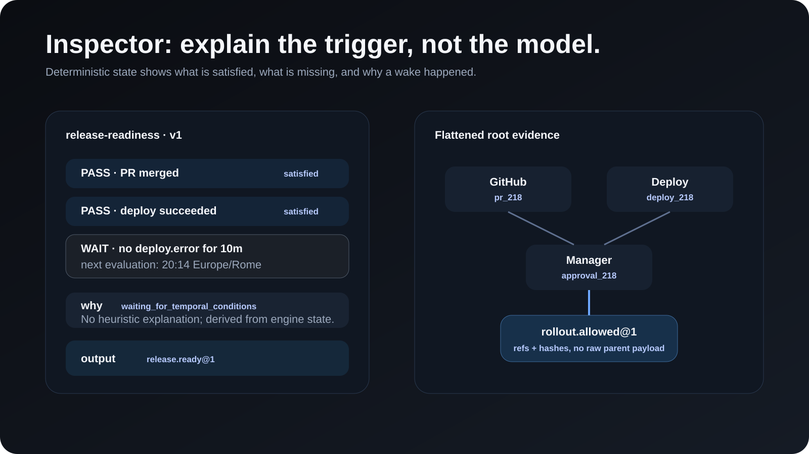
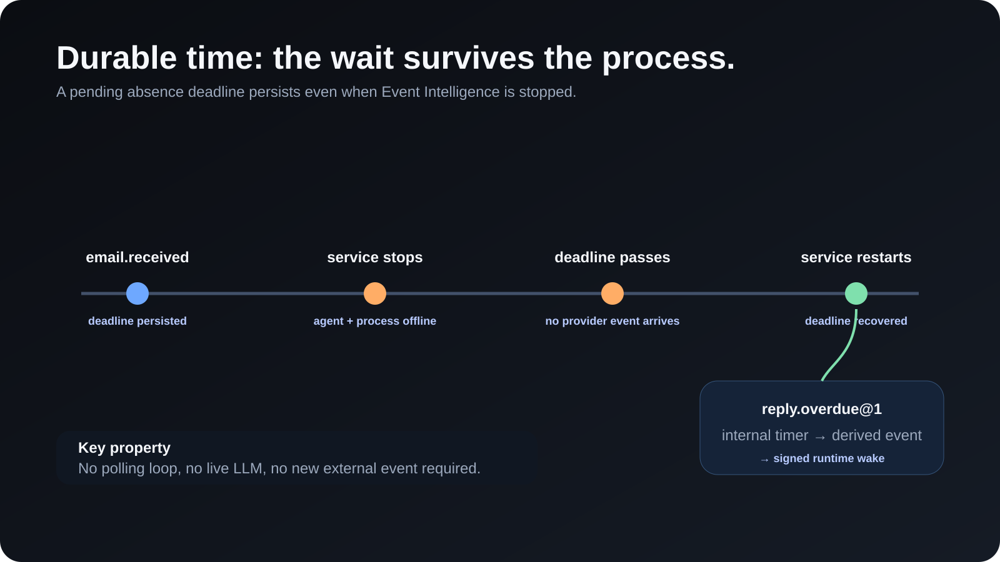

# MCP Event Intelligence

> Durable temporal event intelligence for sleeping agents.

[](https://github.com/sarooo17/event-intelligence/actions/workflows/ci.yml)
[](https://www.npmjs.com/package/mcp-event-intelligence)
[](https://registry.modelcontextprotocol.io/?q=io.github.sarooo17%2Fevent-intelligence)
[](LICENSE)

MCP Event Intelligence is an experimental event runtime for agents that need to react to **future conditions over multiple event sources** without keeping an LLM or agent loop alive.

The primary integration model is **embedded and host-owned**: the agent host keeps its existing MCP clients, transports, OAuth sessions and provider credentials. Event Intelligence receives a reference to the host's MCP registry, discovers the already-connected clients automatically, and uses only the Events-capable ones.

<p align="center">
  
</p>

An agent can express an intent such as:

> When this PR is merged, the production deploy succeeds, and no error is observed for 10 minutes, wake this task and review the release.

Event Intelligence persists that continuation independently of the model, waits for the world to satisfy it, and wakes the host only when necessary.

## Embed it in an existing agent host

Install from npm:

```bash
npm install mcp-event-intelligence
```

Published package: [npm](https://www.npmjs.com/package/mcp-event-intelligence) · [Official MCP Registry](https://registry.modelcontextprotocol.io/?q=io.github.sarooo17%2Fevent-intelligence)

Pass the harness-level MCP registry once — not every MCP one by one:

```js
import {
  createEventIntelligenceHost,
  createMcpRegistryAdapter,
} from 'mcp-event-intelligence/host';

const ei = await createEventIntelligenceHost({
  dataDir: './data',
  mcpRegistry: createMcpRegistryAdapter({
    listConnections: () => host.mcp.listConnections(),
    subscribe: (refresh) => host.mcp.onConnectionsChanged(refresh),
  }),
  wake: async (packet) => {
    const receipt = await host.resume(packet.target, packet);
    return { runtimeReceiptId: receipt.id };
  },
});
```

Event Intelligence enumerates the host registry automatically. GitHub, Gmail, private/company MCPs and future connections do not need to be configured again inside EI. Tools-only MCPs remain available to the agent and are ignored by the Events layer; Events-capable MCPs are attached automatically.


### Shared hosts, tenant isolation and storage

One EI host can serve many tenants/workspaces without sharing trigger state. Give each host-owned MCP connection a `scopeId` and give tenant-facing code only the corresponding scoped view:

```js
const tenant = await ei.scope('tenant-acme');

await tenant.triggerControl.createTrigger({
  definition,
  connectionIds: ['acme-erp'],
  actor,
  owner,
});

const acmeConnections = tenant.mcpStatus();
```

The default reference store physically namespaces non-default scopes under separate persistent store partitions. Trigger IDs, match IDs, cursors, event sources, deadlines, derived events and wake delivery state are therefore resolved inside a scope rather than filtered out of a global result after the fact. The root host object is the trusted operator/control-plane capability; tenant code should receive a scoped view.

Storage is injectable:

```js
const ei = await createEventIntelligenceHost({
  store: myEventIntelligenceStore,
  mcpRegistry,
  wake,
});
```

`PersistentEventStore` remains the zero-dependency default. A custom backend can implement `forScope(scopeId)` to return an isolated tenant view. For horizontally scaled workers, its wake-delivery claim/lease operations must be atomic across processes; the bundled JSONL store provides serialized atomicity inside one process and is a reference backend, not a distributed database.


## Add Events to an MCP provider

Providers can expose the experimental Events boundary without reimplementing the generic JSON-RPC glue:

```js
import { createMcpEventsProvider } from 'mcp-event-intelligence/provider';

const events = createMcpEventsProvider({
  events: [
    {
      descriptor: {
        name: 'erpnext.sales_invoice.submitted',
        description: 'A submitted Sales Invoice was observed.',
        delivery: ['poll'],
        inputSchema: { type: 'object' },
        payloadSchema: {
          type: 'object',
          required: ['name', 'company', 'grand_total'],
          properties: {
            name: { type: 'string' },
            company: { type: 'string' },
            grand_total: { type: 'number' },
          },
        },
      },
      poll: async ({ cursor, maxEvents, context }) => {
        return providerRuntime.pollInvoices({ cursor, maxEvents, context });
      },
    },
  ],
});
```

The package owns capability advertisement, `server/discover`, `events/list`, `events/poll`, common validation and response shapes. The provider owns domain event definitions, authentication, data queries, occurrence IDs and opaque cursor semantics.

This adapter remains experimental compatibility work around MCP Events; it is not a claim of finalized MCP Events conformance.


A concrete ERP-shaped adapter is also exported, so the provider abstraction is exercised against a source structurally different from GitHub:

```js
import {
  createErpNextEventsProvider,
} from 'mcp-event-intelligence/provider/erpnext';

const events = createErpNextEventsProvider({
  pollSalesInvoices: ({ cursor, maxEvents }) =>
    erp.pollSubmittedInvoices({ cursor, maxEvents }),
  pollSalesOrders: ({ cursor, maxEvents }) =>
    erp.pollCreatedSalesOrders({ cursor, maxEvents }),
});
```

It exposes `erpnext.sales_invoice.submitted` and `erpnext.sales_order.created` while leaving ERP authentication/query ownership with the provider.

## What v0.1 implements

### Host-owned event sources

- automatic discovery from the host's existing MCP registry;
- reuse of already-connected MCP clients without duplicate credentials;
- experimental MCP Events capability discovery;
- `events/list` and `events/poll`;
- persistent opaque cursors;
- per-scope source/cursor isolation for shared hosts;
- single-flight polling per connection plus bounded `hasMore` batch draining;
- automatic event-source registration;
- dynamic attach/detach of host MCP clients;
- provider-native compatibility adapters such as GitHub webhooks.

### Composite and temporal triggers

- `allOf`, `anyOf`, `sequence`, `count`;
- deterministic same-value correlation;
- optional semantic correlation;
- `absence`, `not`, `unless`, `after`, `until`;
- `debounce`, `threshold`, `rate`, `distinct`;
- calendar-aware conditions with IANA timezones;
- durable deadlines that continue even when no new provider event arrives.

### Agent-authored continuations

- event-source discovery;
- agent-authored structured trigger definitions;
- deterministic validation against real source schemas and advertised fields;
- approval-gated persistent mutations;
- one-shot, cooldown, max-firings, expiry, leases, update and delete.

### Derived events and composition

Triggers can emit immutable higher-level events instead of waking an agent:

```text
pr.merged + deploy.succeeded
              ↓
        release.ready@1
              +
       manager.approved
              ↓
       rollout.allowed@1
              ↓
          runtime wake
```

Derived events preserve refs-only lineage to their direct parents and flattened root evidence.

<p align="center">
  
</p>

### Versioned contracts

Derived event names are versioned contracts such as `release.ready@1`.

- first producer establishes the canonical schema;
- compatible producers may join the same contract version;
- incompatible schemas fail before trigger persistence;
- multiple versions may coexist;
- ambiguous unversioned consumers fail closed;
- every occurrence carries a schema fingerprint.

### Host or callback wake

An embedded harness can provide one in-process wake dispatcher that routes by `target.runtime`, `target.kind` and `target.id`; runtime-specific handlers remain available as a lower-level option. A standalone deployment can instead use signed HMAC callbacks. Both paths return a stable `runtimeReceiptId`.

Runtime delivery is durable: a stable wake ID gets a persisted delivery record, a worker claims it with a lease, transient failures are retried with bounded exponential backoff, expired claims can be recovered after restart, and only an exhausted retry budget enters dead-letter. This prevents two workers sharing an atomic store from intentionally owning the same delivery at the same time. The runtime should still treat the stable wake ID as an idempotency key because no system can make an arbitrary external side effect transactionally exactly-once without cooperation from the receiver.

## Why this exists

MCP Events is concerned with the event transport/subscription boundary. Event Intelligence explores the layer **above transport**:

- how an agent declares a future condition;
- how multi-event state survives while the agent sleeps;
- how absence/time becomes an event;
- how higher-level facts are derived without invoking a model;
- how those facts can be safely composed;
- how a host resumes an agent effectively once in the validated scenarios.

This project does **not** propose a replacement for MCP Events and does not claim to be an official MCP extension.

## AI and API keys

Event Intelligence has one optional AI boundary: **semantic correlation**.

- `TYPESAFE_API_KEY` enables the bundled TypeSafe Jev evaluator when a trigger explicitly requests semantic correlation.
- embedded hosts may inject a compatible `semanticEvaluator` instead.
- there is no bundled OpenAI planner and no OpenAI API dependency.

The agent/harness is already responsible for reasoning and can author a structured trigger directly from `event_sources_list` / the discovered schemas. Deterministic correlation, temporal logic, persistence, derived events and wake delivery require no model API.

## Full-system acceptance

The v0.1 acceptance suite verifies:

- host-owned MCP client → event discovery/poll → composite match → in-process wake;
- provider-neutral events → composite match → derived event → derived composition → signed runtime wake;
- contract schema evolution and ambiguity rejection;
- refs-only root provenance;
- replay without duplicate derived events or wakes;
- process shutdown while a temporal deadline is pending;
- restart on the same datastore after the deadline;
- wake recovery **without a new provider event**;
- retry-state recovery after process restart and lease-based concurrent-worker exclusion;
- shared-host tenant isolation with identical trigger IDs in different scopes;
- bounded/single-flight provider polling;
- provider-generalization coverage with ERPNext-shaped invoice/order events;
- hash-linked audit verification.

A separate live regression also verified real GitHub webhook ingress into the MCP EventOccurrence / composite fan-in path.

## Standalone reference service

### Requirements

- Node.js 22+
- no external database for the reference setup

```bash
git clone https://github.com/sarooo17/event-intelligence.git
cd event-intelligence
npm ci
npm run check

export SERVICE_AUTH_TOKEN="$(openssl rand -hex 32)"
npm start
```

Then:

```bash
curl http://127.0.0.1:3000/readyz
```

The standalone service supports manual/provider-native event ingress. It does not own arbitrary MCP connections; host-owned MCP reuse belongs to the package integration above.

### Docker

```bash
docker build -t mcp-event-intelligence:0.1.0 .

docker run --rm \
  -p 3000:3000 \
  -v mcp-event-intelligence-data:/data \
  -e SERVICE_AUTH_TOKEN="$(openssl rand -hex 32)" \
  mcp-event-intelligence:0.1.0
```

## Optional MCP control plane

The package also exposes a standard **MCP stdio** control plane through the official TypeScript SDK v2:

```bash
npx mcp-event-intelligence mcp
```

Read/non-mutating tools are exposed by default, including `event_sources_list`, inspection, simulation, contracts and runtime status. An agent uses those discovered source schemas to author the structured definition passed to `trigger_create`.

Persistent trigger mutations are only registered when the operator explicitly enables `MCP_WRITE_ENABLED=true`, and each mutation still requires a `confirmationId`. The MCP server is a control-plane adapter; it is **not** a gateway through which the host's other MCP servers must be reconnected.

See [docs/QUICKSTART.md](docs/QUICKSTART.md) and [docs/MCP-REGISTRY.md](docs/MCP-REGISTRY.md).

## Configuration

Standalone/core environment variables:

| Variable | Required | Purpose |
| --- | --- | --- |
| `SERVICE_AUTH_TOKEN` | yes for protected HTTP APIs | bearer token for control-plane endpoints |
| `DATA_DIR` | no | persistent JSONL directory, default `./data` |
| `PORT` | no | HTTP port, default `3000` |
| `ENVIRONMENT_ID` | no | environment boundary |
| `RUNTIME_WAKE_TARGETS_JSON` | no | signed standalone runtime callbacks |
| `GITHUB_WEBHOOK_SECRET` | no | verify GitHub webhook ingress |
| `TYPESAFE_API_KEY` | no | bundled TypeSafe Jev semantic evaluator |
| `WAKE_DELIVERY_MAX_ATTEMPTS` | no | maximum wake delivery attempts, default `5` |
| `WAKE_DELIVERY_LEASE_MS` | no | claim lease duration, default `30000` |
| `WAKE_RETRY_BASE_DELAY_MS` | no | first retry delay, default `1000` |
| `WAKE_RETRY_MAX_DELAY_MS` | no | retry backoff cap, default `60000` |
| `WAKE_RETRY_TICK_MS` | no | retry scheduler tick, default `1000` |

Embedded hosts pass one MCP registry adapter. Event Intelligence discovers already-connected clients from that registry; provider MCP connection settings are not duplicated inside EI.

## Architecture

The detailed execution model, clocks, lifecycle, persistence and trust boundaries are documented in [docs/ARCHITECTURE.md](docs/ARCHITECTURE.md).

## Important semantics

### Event-time vs processing-time

Normal event windows use event `occurredAt`.

Absence/deadline progression uses Event Intelligence processing time. This separation is explicit and tested.

<p align="center">
  
</p>

### Effectively-once runtime activation

The implementation does not claim theoretical distributed exactly-once delivery.

It uses stable wake IDs, persisted delivery state, atomic claim leases, bounded retries, runtime receipts and replay handling to provide effectively-once runtime activation in the validated reference scenarios.

### Derived event vs current state

A derived event says **what became true at a point in history**.

v0.1 intentionally does not implement a mutable current-state/facts database.

## Security

Read [SECURITY.md](SECURITY.md) and [docs/SECURITY-MODEL.md](docs/SECURITY-MODEL.md).

In embedded mode, the host retains MCP authorization and credentials; Event Intelligence discovers only the client objects exposed through the host-provided MCP registry. Tenant-facing callers should receive only `host.scope(scopeId)`. The reference JSONL store is scope-partitioned and single-process; distributed custom stores must preserve scope isolation and atomic wake claims.

## MCP compatibility status

There are two separate MCP boundaries:

- **event ingress**: host-owned, already-connected MCP clients exposing experimental Events, plus provider-native adapters;
- **control plane**: optional standard MCP **stdio** server built on the official TypeScript SDK v2 and targeting protocol revision 2026-07-28.

Registry identity:

```text
io.github.sarooo17/event-intelligence
```

`server.json` is validated with the official `mcp-publisher validate` command in CI. MCP Events itself remains experimental and may change as the Triggers & Events work evolves.

## Project status

**v0.1 reference implementation / experimental.**

The architecture is implemented and exercised end-to-end. Storage is now injectable and scoped, while the bundled JSONL backend remains a single-process reference implementation. Remaining work is primarily production database adapters/HA validation, scale benchmarks and upstream feedback.

## Example

See the [release-gate example](docs/examples/release-gate.md) for a composed future-condition flow using durable time, derived events and targeted wake.

## Contributing

See [CONTRIBUTING.md](CONTRIBUTING.md).

Contributions are especially useful around host adapters, MCP Events compatibility, temporal semantics, production persistence, security review and reproducible provider integrations.

## License

Apache License 2.0. See [LICENSE](LICENSE).

## Disclaimer

This is an independent open-source project. It is not an official Model Context Protocol specification and is not affiliated with or endorsed by the MCP maintainers.
